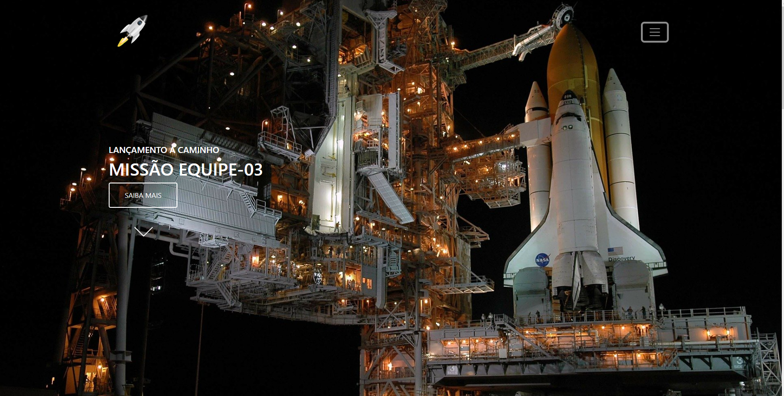
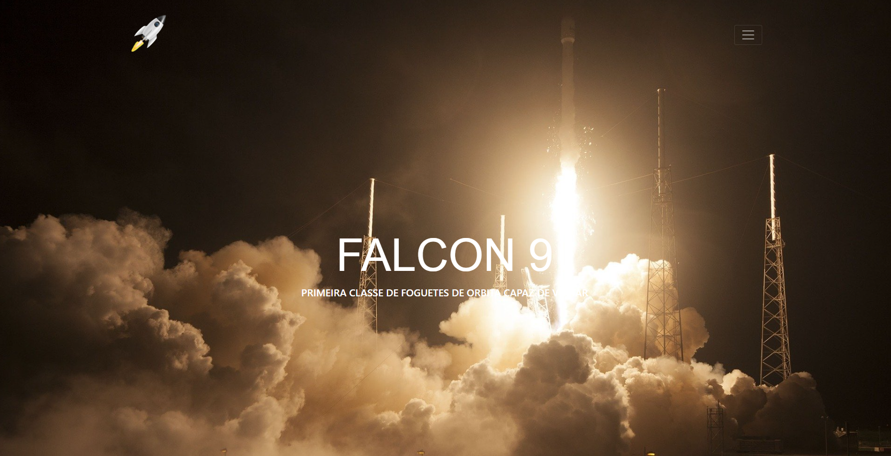
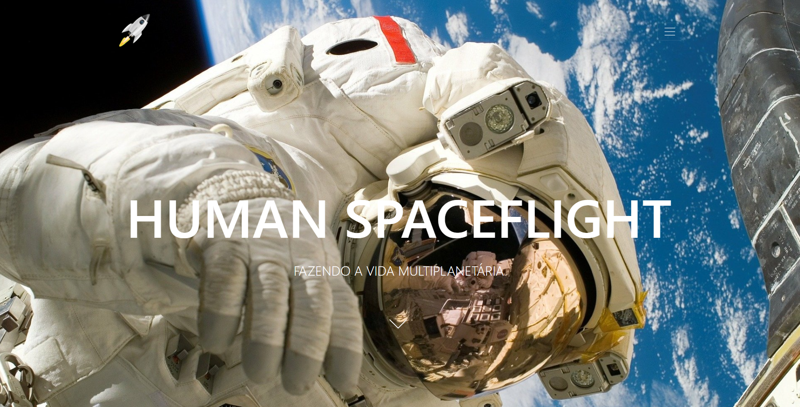

# PROJETO CÓPIA DO SITE SPACEX 

Projeto realizado no curso [OneBitCode](https://programador.onebitcode.com/?ref=C54036552P&gclid=CjwKCAjwhNWZBhB_EiwAPzlhNkXCP8JEqaG7lE6CX10pjv3q7n42Jn215e_cq0kXOt0fDRP5l5TauRoCsMgQAvD_BwE). 

## IMAGENS DO PROJETO

- Pagina Home
</img>

- Pagina Falcon9
</img>

- Pagina HumamFlight
</img>

## Requisitos

- [Bootstrap](https://getbootstrap.com) 
- [Sass](https://sass-lang.com) 

## Bibliotecas 

- [AOS](http://michalsnik.github.io/aos/)
- [Bootstrap Icons](https://icons.getbootstrap.com)

## Minhas alterações

- Adição de modal na página HOME
- Alteração na logo
